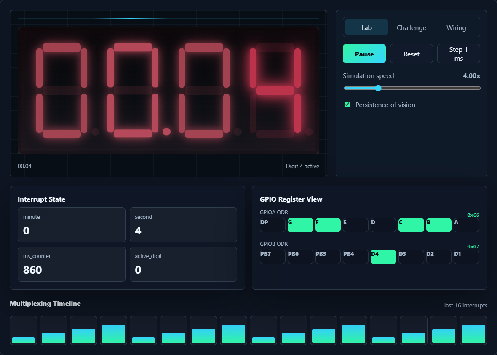
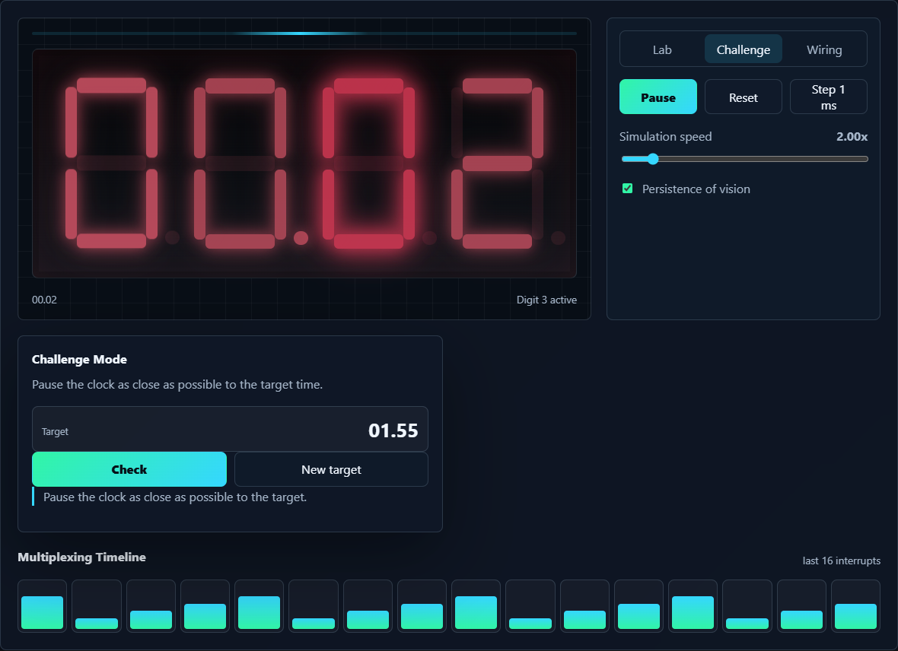
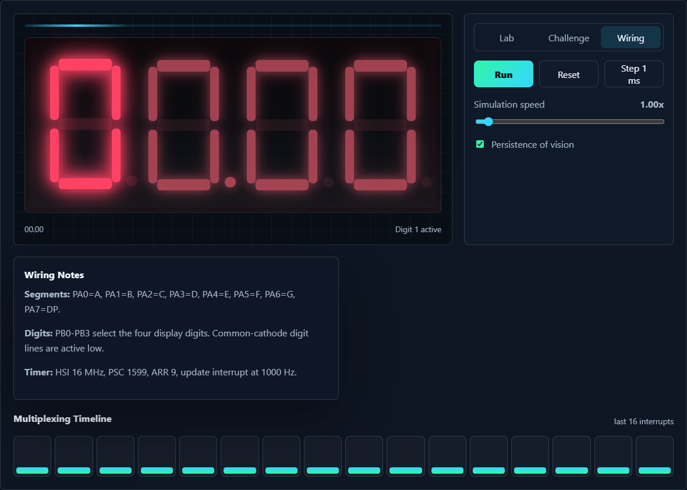

# STM32 Digital Clock - my timer interrupt project


So this is my microcontroller / microprocessor course project: a small digital clock built with an **STM32F401RE** and a 4-digit common-cathode seven-segment display. It sounds simple at first, just show minutes and seconds, right? But then multiplexing, timer interrupts, Proteus wiring, and duplicate interrupt handlers all show up and suddenly it becomes a real project.

Long story short, the clock counts from `00.00` to `59.59`, then goes back to `00.00`. The display format is basically `MM.SS`. I used the decimal point after the second digit because the Proteus `7SEG-MPX4-CC` part doesn't really give me a proper colon. Not perfect, but it gets the point across.

The final firmware logic is written mostly with direct register access. I didn't use `HAL_Delay()` or delay loops for the actual time counting, because the whole idea of the assignment was to use timers and interrupts properly. Honstly, getting TIM2 and the interrupt handler to behave was the most annoying part 😅.

## Live Demo

The project also has a frontend web demo now. I added it because just showing C code and a Proteus screenshot felt a bit dry. The web version makes the timer interrupt and multiplexing idea easier to see.

Live demo link:

```text
https://mohadesehesmaeilzadeh.github.io/stm32-digital-clock/web_demo/
```

Main web interface screenshot:


## What this thing actually does

At the hardware level, the STM32 controls a 4-digit seven-segment display. The segment pins are shared between all digits, so the microcontroller can't just turn on all four digits independently at the same time. Instead, it turns on one digit, writes the segment pattern for that digit, then quickly moves to the next digit. This happens so fast that our eyes see a stable four-digit number.

The timer setup is based on the internal **16 MHz HSI clock**. TIM2 is configured so it creates an update interrupt every **1 ms**:

```text
16 MHz / ((1599 + 1) * (9 + 1)) = 1000 Hz
```

So yeah, one interrupt every millisecond. In each interrupt, the code refreshes one display digit and increments a millisecond counter. After 1000 interrupts, one second has passed. After 60 seconds, the minute value increases. After 59 minutes and 59 seconds, it rolls over.

## Pin connections

The segment pins are connected like this:

| STM32 Pin | Display Segment |
| --- | --- |
| PA0 | A |
| PA1 | B |
| PA2 | C |
| PA3 | D |
| PA4 | E |
| PA5 | F |
| PA6 | G |
| PA7 | DP |

And the digit select pins:

| STM32 Pin | Display Digit |
| --- | --- |
| PB0 | Digit 1 |
| PB1 | Digit 2 |
| PB2 | Digit 3 |
| PB3 | Digit 4 |

Because the display is common cathode, the digit select lines are **active low**. That little detail is easy to forget, and then everything looks broken even when the code is kinda fine.

## Architecture, in normal words

```text
HSI 16 MHz
   |
   v
RCC clock setup
   |
   v
TIM2 update interrupt every 1 ms
   |
   +--> refresh one seven-segment digit
   |
   +--> count milliseconds, seconds, and minutes
   |
   v
GPIOA writes segment pattern
GPIOB selects active digit
   |
   v
7SEG display shows MM.SS
```

Why did I do it this way? Well, using interrupts means the CPU doesn't waste time sitting in a delay loop. The `while(1)` loop is basically empty, which felt weird at first, but that's the point. The timer is doing the regular timing work in the background.

## Web demo screenshots

I made the web demo in pure HTML, CSS, and JavaScript. No backend, no database, no npm install. It is just a static frontend, so it can run directly on GitHub Pages.

### Demo landing page


This is the main landing page. I tried to make it feel more like a proper tech portfolio project instead of a plain student submission. It has the project story, architecture, technologies, gallery, and the simulator section.

### Lab mode



Lab mode is the most useful one for explaining the firmware. It shows the animated seven-segment display, current interrupt state, `ms_counter`, active digit, GPIOA segment output, GPIOB digit output, and the multiplexing timeline.

### Challenge mode



Challenge mode is just a small game I added for fun. You pause the simulated clock as close as possible to a target time. It sounds silly, but it actually makes the timer behavior more memorable.

### Wiring mode



Wiring mode explains how the software maps to the actual circuit: PA0-PA7 for segments, PB0-PB3 for digit selection, and TIM2 for the 1 ms interrupt.

## Proteus and CubeMX screenshots

### Proteus simulation


This is the circuit in Proteus. The STM32F401RE is connected to the four-digit display through resistors. The running simulation shows the clock value on the seven-segment display.

### CubeMX pinout


Here PA0-PA7 and PB0-PB3 are configured as outputs. SWD pins are still enabled because debugging/programming without them would be pain.

### CubeMX clock configuration


The project was first generated with CubeMX, but the final code sets the important clock/timer behavior directly in `main.c`. For Proteus, I used the internal 16 MHz HSI clock because it was simpler and more stable.

## Files and folders

```text
stm32-digital-clock/
  DigitalClock/
    Core/
      Inc/
      Src/
      Startup/
    Debug/
      DigitalClock.hex
    DigitalClock.ioc
    STM32F401RETX_FLASH.ld
    STM32F401RETX_RAM.ld
  docs/
    images/
      proteus-simulation.png
      cubemx-pinout.png
      cubemx-clock-config.png
  web_demo/
    assets/
      images/
        screenshot-latest.png
        demo-lab.png
        demo-challenge.png
        demo-wiring.png
    tools/
      capture-screenshot.ps1
    index.html
    styles.css
    app.js
  DigitalClock.pdsprj
  README.md
  .gitignore
```

The main firmware is in `DigitalClock/Core/Src/main.c`. That file has the clock initialization, GPIO setup, TIM2 setup, seven-segment lookup table, digit refresh function, and `TIM2_IRQHandler`.

`stm32f4xx_it.c` still exists because CubeMX generated it, but the default TIM2 handler is commented out. I had a duplicate `TIM2_IRQHandler` problem at one point and it produced a multiple-definition error. Took me longer than I want to admit to notice that CubeMX had already made one.

## Running the embedded project

For STM32CubeIDE:

```text
File > Import > Existing Projects into Workspace
```

Then select the `DigitalClock/` folder and build it. The HEX file should be generated in:

```text
DigitalClock/Debug/DigitalClock.hex
```

For Proteus, open:

```text
DigitalClock.pdsprj
```

Make sure the STM32 program file points to `DigitalClock/Debug/DigitalClock.hex`, and set the MCU clock frequency to `16 MHz`.

## Running the web demo

Quick way: just open this file in a browser:

```text
web_demo/index.html
```

Or run a tiny local server from the repo root:

```bash
python -m http.server 8000
```

Then open:

```text
http://localhost:8000/web_demo/
```

## Updating the web screenshot

I added a small PowerShell script for this, mostly so I don't have to manually crop screenshots every time I change the design.

```powershell
powershell -ExecutionPolicy Bypass -File web_demo/tools/capture-screenshot.ps1
```

The README uses this image:

```text
web_demo/assets/images/screenshot-latest.png
```

So if the design changes, I just rerun the script, commit the new image, and the README updates automatically.

## GitHub Pages deployment

To host it for free:

1. Go to the GitHub repository.
2. Open `Settings`.
3. Go to `Pages`.
4. Choose `Deploy from a branch`.
5. Select `main`.
6. Select `/root`.
7. Save it and wait a bit.

The web demo should show up here:

```text
https://mohadesehesmaeilzadeh.github.io/stm32-digital-clock/web_demo/
```

Vercel and Netlify can also host it, but GitHub Pages is the easiest for this because the project is already on GitHub.

## What I learned

The biggest thing I learned is that interrupts are powerful but also very unforgiving. If the interrupt flag isn't cleared properly, or if two files define the same handler, the whole project gets weird fast. Also, multiplexing looks simple in diagrams but wiring it and matching the logic levels takes some patience.

Another thing: keeping the project clean for GitHub matters. Build outputs, absolute paths, missing driver folders, random workspace files... all of these can make a repo look messy. I had to clean that up and write the README so someone else can actually understand what is going on.

Note to self: always check whether the display is common cathode or common anode before blaming the code 💀.

## What I'd improve later

If I had more time, I would add push buttons to set the time, maybe add an alarm mode, and use transistor drivers for the digit select lines in real hardware. For the web demo, I might add a small code viewer that highlights the C interrupt handler while the simulator runs. That would be pretty neat.

## Git commands I used

```bash
git status
git add .
git commit -m "Finalize README and web demo screenshots"
git push origin main
```

## Credits

Course project for a microcontroller/microprocessor class, July 2026.

Author:

- Mohadeseh Esmaeilzadeh

