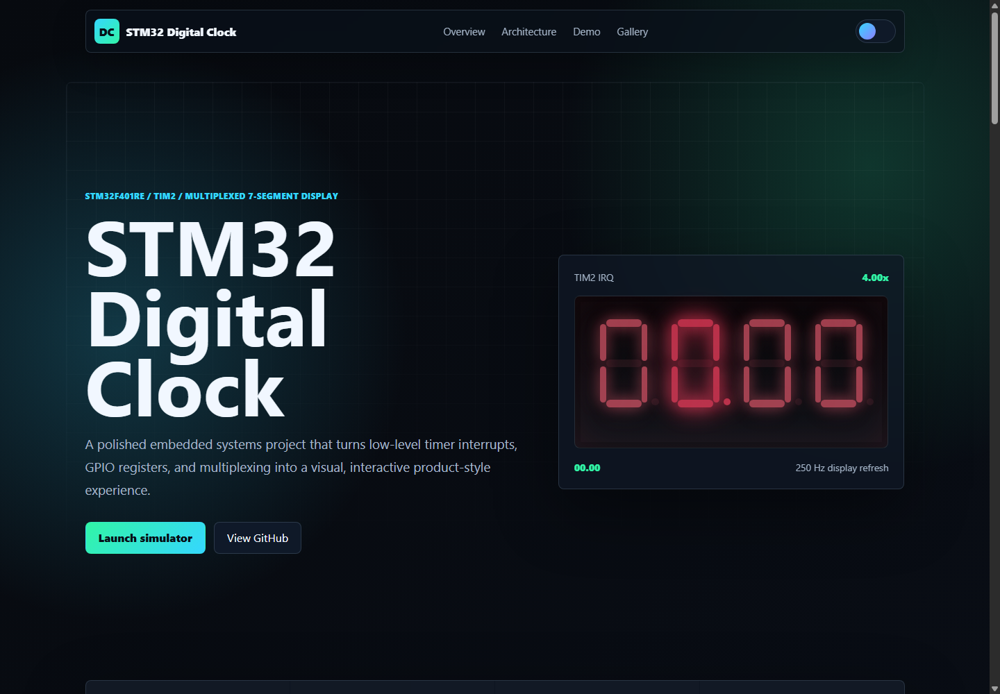

# STM32 Digital Clock on 4-Digit Seven-Segment Display


## Overview

This project implements a digital clock using an STM32F401RE microcontroller and a 4-digit common-cathode seven-segment display. The clock shows time in `MM.SS` format, where the decimal point after the second digit is used as the separator between minutes and seconds.

The final application logic is written with direct register access. TIM2 generates a 1 ms interrupt, and that interrupt is used for both display multiplexing and time counting. No delay loop is used for the clock timing.

The repository also includes a premium frontend web interface that presents the project like a product landing page and simulates the timer interrupt, GPIO register state, and multiplexed display behavior directly in the browser.

## Features

- Counts from `00.00` to `59.59`, then rolls over to `00.00`.
- Uses TIM2 update interrupt every 1 ms.
- Refreshes the four display digits using multiplexing.
- Drives segment pins directly from GPIOA.
- Selects active display digit using GPIOB.
- Uses the internal 16 MHz HSI clock for stable Proteus simulation.
- Includes STM32CubeIDE project files and a Proteus simulation project.
- Includes a modern responsive web interface and browser-based simulator.

## 🌐 Web Demo

The web demo is located in [`web_demo/`](web_demo/). It is a self-contained frontend built with pure HTML, CSS, and JavaScript. It does not need a backend, database, package installation, or build step.

Live demo link:

```text
https://mohadesehesmaeilzadeh.github.io/stm32-digital-clock/web_demo/
```

Latest web interface screenshot:



The web interface includes:

- premium responsive landing page design
- dark/light theme toggle
- animated four-digit seven-segment display
- TIM2 1 ms interrupt simulation
- GPIOA/GPIOB register visualization
- active digit multiplexing timeline
- speed control, pause, reset, and single-step mode
- challenge mode for stopping the clock on a target time
- architecture diagram, technology badges, feature cards, gallery, and GitHub CTA

### Run Locally

Option 1: open the file directly:

```bash
web_demo/index.html
```

Option 2: run a local static server from the repository root:

```bash
python -m http.server 8000
```

Then open:

```text
http://localhost:8000/web_demo/
```

### Deploy With GitHub Pages

1. Push the repository to GitHub.
2. Open the repository on GitHub.
3. Go to `Settings > Pages`.
4. Under `Build and deployment`, choose `Deploy from a branch`.
5. Select branch `main`.
6. Select folder `/root`.
7. Save.
8. Open:

```text
https://mohadesehesmaeilzadeh.github.io/stm32-digital-clock/web_demo/
```

Other free hosting options:

- Vercel: import the GitHub repository and set the output/static directory to the repository root.
- Netlify: import the GitHub repository and publish the repository root.

### Screenshot Auto-Update

The README always points to:

```text
web_demo/assets/images/screenshot-latest.png
```

To update that screenshot after changing the design, run this from the repository root on Windows:

```powershell
powershell -ExecutionPolicy Bypass -File web_demo/tools/capture-screenshot.ps1
```

To capture a specific simulator mode:

```powershell
powershell -ExecutionPolicy Bypass -File web_demo/tools/capture-screenshot.ps1 -Mode challenge
powershell -ExecutionPolicy Bypass -File web_demo/tools/capture-screenshot.ps1 -Mode wiring
```

Commit the updated `web_demo/assets/images/screenshot-latest.png` after running the script. Because the filename stays the same, the README automatically shows the newest screenshot.

### Final Folder Tree

```text
stm32-digital-clock/
  DigitalClock/
    Core/
      Inc/
      Src/
      Startup/
    Debug/
      DigitalClock.hex
    DigitalClock.ioc
    STM32F401RETX_FLASH.ld
    STM32F401RETX_RAM.ld
  docs/
    images/
      proteus-simulation.png
      cubemx-pinout.png
      cubemx-clock-config.png
  web_demo/
    assets/
      images/
        screenshot-latest.png
    tools/
      capture-screenshot.ps1
    index.html
    styles.css
    app.js
  DigitalClock.pdsprj
  README.md
  .gitignore
```

### Git Commands

```bash
git status
git add README.md .gitignore web_demo
git add -u
git commit -m "Add premium web demo interface"
git push origin main
```

## Screenshots

### Proteus Simulation Circuit


This screenshot shows the complete Proteus schematic. The STM32F401RE drives a `7SEG-MPX4-CC` four-digit common-cathode display. PA0 to PA7 are connected to the segment lines through current-limiting resistors, and PB0 to PB3 select the active digit. The running simulation shows the clock value on the multiplexed display.

### STM32CubeMX Pinout Configuration


This screenshot shows the STM32CubeMX pinout setup for the STM32F401RETx. GPIO pins PA0 to PA7 are configured as outputs for the seven-segment lines, while PB0 to PB3 are configured as outputs for digit selection. SWD pins are left enabled for debugging/programming.

### STM32CubeMX Clock Configuration


This screenshot shows the CubeMX clock tree. The project was originally generated with CubeMX, but the final application code configures the clock directly in `main.c` and uses the internal 16 MHz HSI clock for simpler and more stable Proteus simulation timing.

## Hardware

| Component | Purpose |
| --- | --- |
| STM32F401RE | Main microcontroller |
| 7SEG-MPX4-CC | Four-digit common-cathode seven-segment display |
| 330 ohm resistors | Segment current limiting |
| 10k ohm resistor | Reset pull-up |
| 3.3 V supply | MCU supply |
| GND | Common ground |

## Pin Connections

### Segment Pins

| STM32 Pin | Display Pin |
| --- | --- |
| PA0 | A |
| PA1 | B |
| PA2 | C |
| PA3 | D |
| PA4 | E |
| PA5 | F |
| PA6 | G |
| PA7 | DP |

### Digit Select Pins

The display is common cathode, so digit select pins are active low.

| STM32 Pin | Digit |
| --- | --- |
| PB0 | Digit 1 |
| PB1 | Digit 2 |
| PB2 | Digit 3 |
| PB3 | Digit 4 |

## Architecture

```text
          +----------------------+
          | Internal HSI 16 MHz  |
          +----------+-----------+
                     |
                     v
          +----------------------+
          | RCC clock control    |
          +----------+-----------+
                     |
        +------------+-------------+
        |                          |
        v                          v
+---------------+          +----------------+
| GPIOA PA0-PA7 |          | TIM2 1 ms IRQ  |
| segment data  |          +-------+--------+
+-------+-------+                  |
        |                          v
        v                  +----------------+
+---------------+          | TIM2_IRQHandler|
| 7-seg segments|          +-------+--------+
+---------------+                  |
                                   v
                         +--------------------+
                         | Refresh one digit  |
                         | Count milliseconds |
                         | Update MM.SS       |
                         +---------+----------+
                                   |
                                   v
                         +--------------------+
                         | GPIOB PB0-PB3      |
                         | active-low digit   |
                         +--------------------+
```

## Program Flow

```text
Reset
  |
  v
Clock_Init_16MHz()
  |
  v
GPIO_Init()
  |
  v
Display_UpdateDigits()
  |
  v
TIM2_Init_1ms()
  |
  v
Main loop stays empty
  |
  v
TIM2 interrupt every 1 ms:
  - clear timer interrupt flag
  - refresh one display digit
  - increment millisecond counter
  - every 1000 ms, increment seconds
  - every 60 seconds, increment minutes
  - every 60 minutes, reset to 00.00
```

## Important Source Files

| File | Description |
| --- | --- |
| `Core/Src/main.c` | Main direct-register application code, GPIO setup, TIM2 setup, display refresh, and interrupt handler |
| `Core/Src/stm32f4xx_it.c` | CubeMX interrupt file; TIM2 handler is commented out to avoid duplicate definition |
| `Core/Src/gpio.c` | CubeMX-generated GPIO initialization, not used by the final direct-register flow |
| `Core/Src/tim.c` | CubeMX-generated TIM2 initialization, not used by the final direct-register flow |
| `Core/Startup/startup_stm32f401retx.s` | Startup code and interrupt vector table |
| `STM32F401RETX_FLASH.ld` | Flash linker script |
| `DigitalClock.ioc` | STM32CubeMX configuration file |
| `DigitalClock.pdsprj` | Proteus simulation project |

## Build Instructions

### STM32CubeIDE

1. Open STM32CubeIDE.
2. Select `File > Import > Existing Projects into Workspace`.
3. Choose the project folder.
4. Build the project.
5. The generated HEX file should be available under `Debug/DigitalClock.hex`.

### Proteus Simulation

1. Open `DigitalClock.pdsprj` in Proteus.
2. Confirm the STM32F401RE program file points to the generated `DigitalClock.hex`.
3. Set the MCU clock frequency to `16 MHz`.
4. Run the simulation.
5. The display should count in `MM.SS` format.

## Notes

- The Proteus display uses `7SEG-MPX4-CC`, so segment pins turn on with logic `1`, and digit select pins turn on with logic `0`.
- The decimal point of the second digit is used as the separator because the selected display part does not provide a true colon.
- For real hardware, consider using transistor drivers for the digit select lines instead of driving all digit commons directly from MCU pins.

## Credits

Course project for a microcontroller/microprocessor class.

Authors:

- Mohadeseh Esmaeilzadeh
